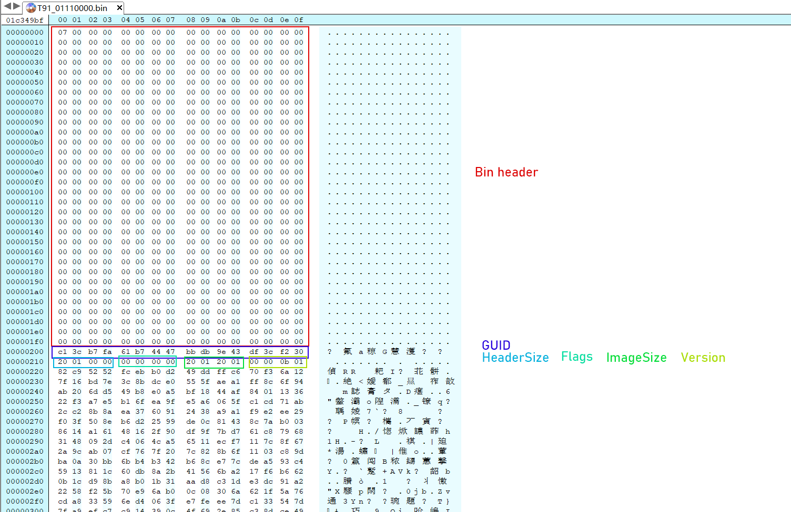
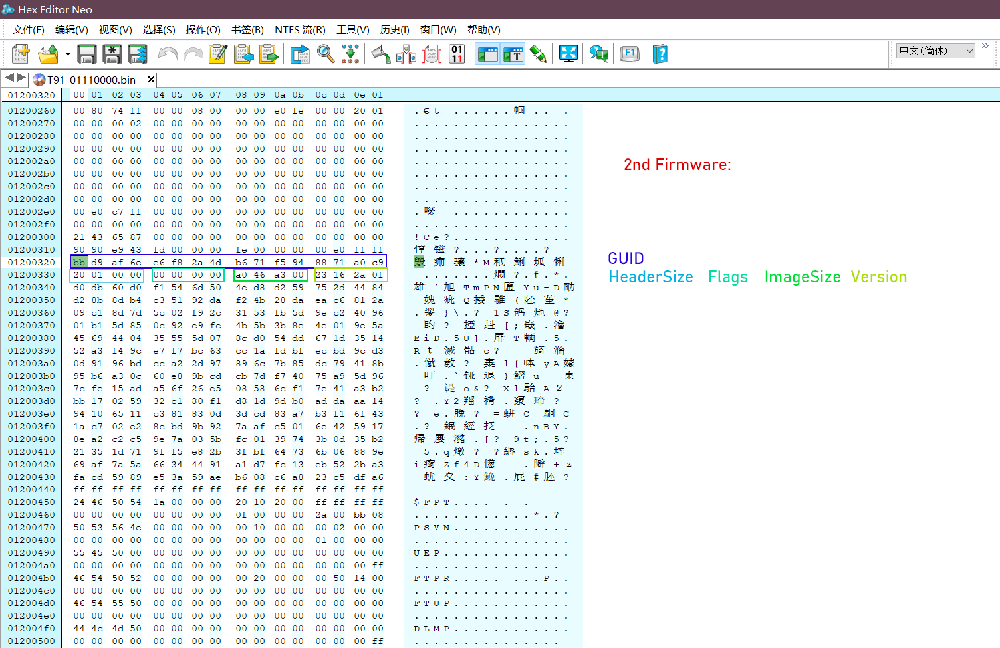

# HP-bios_dump
support model intel-Gen11 (or later?)

***

file: HP Elite x2 G8 Tablet bios update(T91) sp143310.exe

***

1. 7-zip unpack Modelcode-version.bin
2. hexedit open bin file
    
    0x0 - 0x200 Bin header
    0x200 - 0x210 Firmware Header of GUID: fab73cc1-b761-4744-bbdb-9e43df3cf230
    0x210 - 0x214 Firmware Header of HeaderSize: 0x120
    0x214 - 0x218 Firmware Header of Flags: 0
    0x218 - 0x21c Firmware Header of CapsuleImageSize: 0x1200120
    0x21c - 0x300 Firmware Header of Version: 0x01010200
   
    Firmware fab73cc1-b761-4744-bbdb-9e43df3cf230 (Bios region)
    region: 0x320 - 0x1200320
    
    
    2nd Firmware:
    0x1200320 - 0x1200330 Firmware Header of GUID: 6eafd9bb-f8e6-4d2a-b671-f5948871a0c9
    0x1200330 - 0x1200334 Firmware Header of HeaderSize: 0x120
    0x1200334 - 0x1200338 Firmware Header of Flags: 0
    0x1200338 - 0x120033c Firmware Header of CapsuleImageSize: 0xa346a0
    0x120033c - 0x1200340 Firmware Header of Version: 0xf2a1623
   
    Firmware 6eafd9bb-f8e6-4d2a-b671-f5948871a0c9 (ME FWupdate)
    region: 0x1200440 - 0x1c349c0
    
    3rd Firmware:
    ...